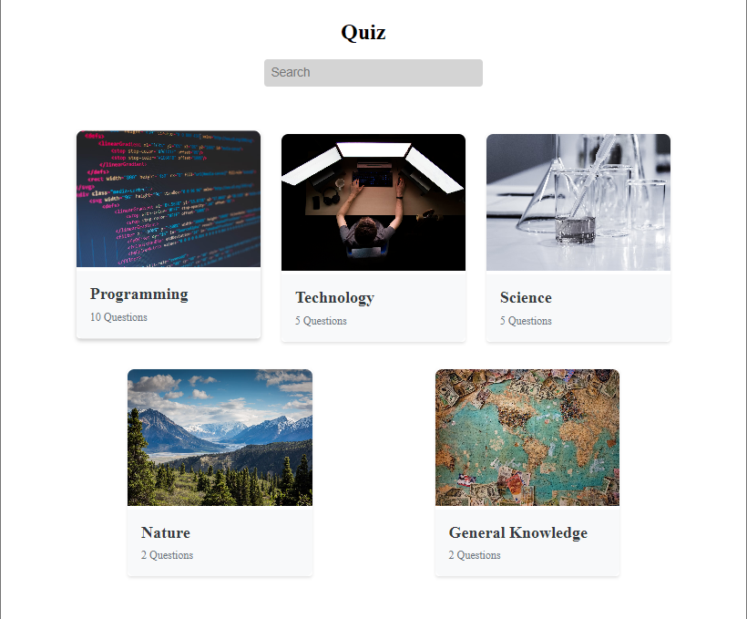
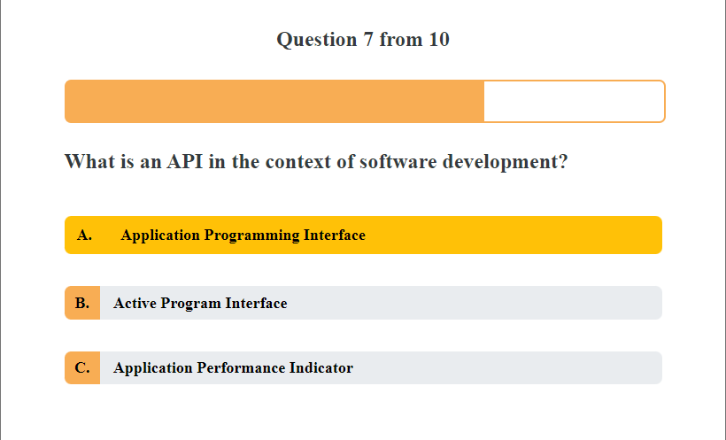
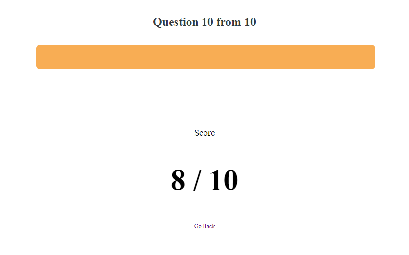

# Quiz

A simple and interactive quiz application built with Vue.js.

## Features

-   Multiple quiz categories
-   Randomized questions for each quiz
-   Real-time progress tracking
-   Final score display with the option to retake quizzes

## Installation

1. Clone the repository: `git clone https://github.com/twingqywingqy/quiz-vue.git`
2. Install dependencies: `npm install`
3. Run the application: `npm run serve`

## Usage

1. Open your browser and navigate to http://localhost:8080
2. Select a quiz category
3. Answer the questions
4. View your score at the end

## Contributing

1. Fork the repository
2. Create a new branch: `git checkout -b feature/your-feature`
3. Commit your changes: `git commit -m 'Add some feature'`
4. Push to the branch: `git push origin feature/your-feature`
5. Open a pull request

## Screenshots

